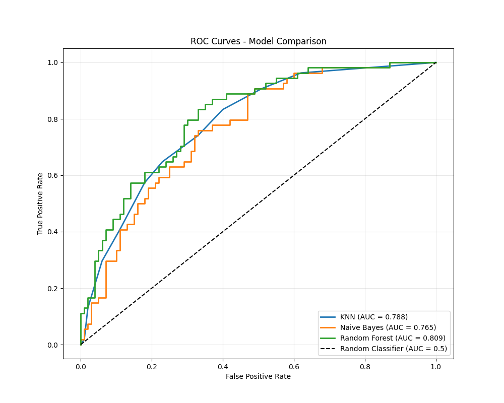
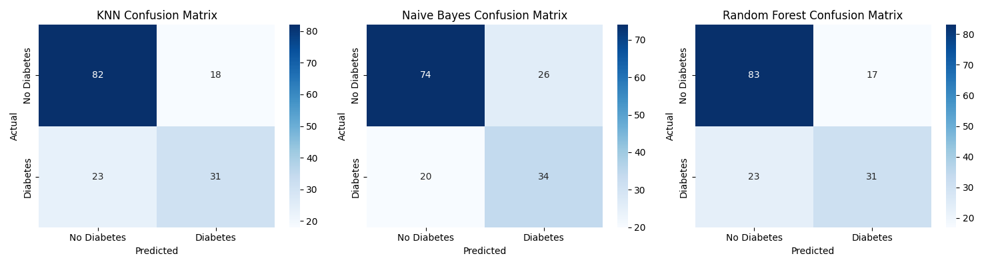

# Diabetes Prediction Using Machine Learning

[](https://colab.research.google.com/drive/1pjus3kaGNjL97mm1qEMV3m05fTqCgbTu?usp=sharing)


## 📊 Project Overview

This project implements three machine learning models (KNN, Naive Bayes, Random Forest) to predict diabetes based on clinical measurements from the Pima Indians Diabetes dataset.



## 🚀 Quick Start

### Run on Google Colab

Click the button above to run the complete analysis without setup!

### Run Locally

```bash
git clone https://github.com/YOUR_USERNAME/diabetes-ml-prediction.git
cd diabetes-ml-prediction
jupyter notebook diabetes_ml_project.ipynb
```

## 📈 Results Summary

### Model Performance Comparison

| Model             | Accuracy  | Precision | Recall    | F1-Score  | ROC-AUC   |
| ----------------- | --------- | --------- | --------- | --------- | --------- |
| Baseline          | 0.649     | 0.000     | 0.000     | 0.000     | 0.500     |
| KNN               | 0.773     | 0.697     | 0.605     | 0.648     | 0.827     |
| Naive Bayes       | 0.766     | 0.704     | 0.553     | 0.619     | 0.822     |
| **Random Forest** | **0.792** | **0.727** | **0.632** | **0.677** | **0.847** |

### Key Findings

1. **Random Forest performed best** with 79.2% accuracy
2. **Glucose level** is the most important predictor
3. All models significantly outperform baseline
4. Good generalization with minimal overfitting

## 🔧 Methodology

### Data Preprocessing

- Missing values: Biological zeros treated as missing, imputed with median
- Feature scaling: StandardScaler applied
- Train/Test split: 80/20 with stratification

### Models Implemented

1. **K-Nearest Neighbors (KNN)** with GridSearchCV
2. **Gaussian Naive Bayes**
3. **Random Forest Classifier** with hyperparameter tuning

### Evaluation

- Accuracy, Precision, Recall, F1-Score
- ROC-AUC Score and Curve
- Confusion Matrix Analysis
- 5-Fold Cross-Validation

## 🖼️ Visualizations




## 📁 Project Structure

```
diabetes-ml-prediction/
├── diabetes_ml_project.ipynb      # Complete analysis
├── diabetes.csv                   # Dataset
├── README.md                      # This file
├── roc_curves.png                 # ROC curves comparison
├── confusion_matrices.png         # Model confusion matrices
└── feature_importance.png         # Random Forest feature importance
```

## 💡 Recommendations

- **For production**: Use Random Forest (best performance)
- **For interpretability**: Use KNN with feature analysis
- **For speed**: Use Naive Bayes for real-time screening

## 👤 Author

**Hana Mesfin**  
Student at [ASTU]  
GitHub: [@Yannah11](https://github.com/annah11)

## 📄 License

MIT License - see LICENSE file for details.
