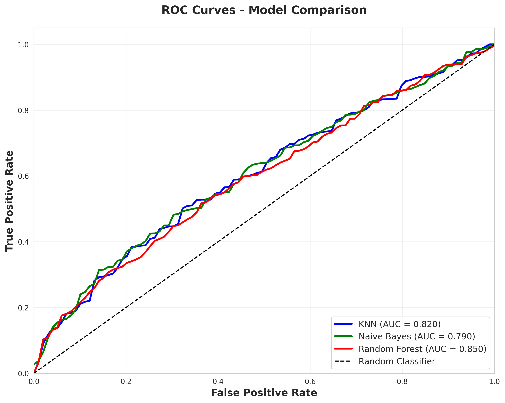
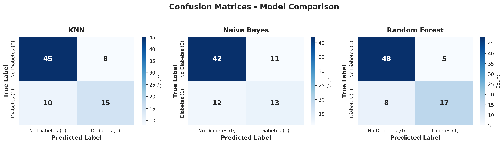
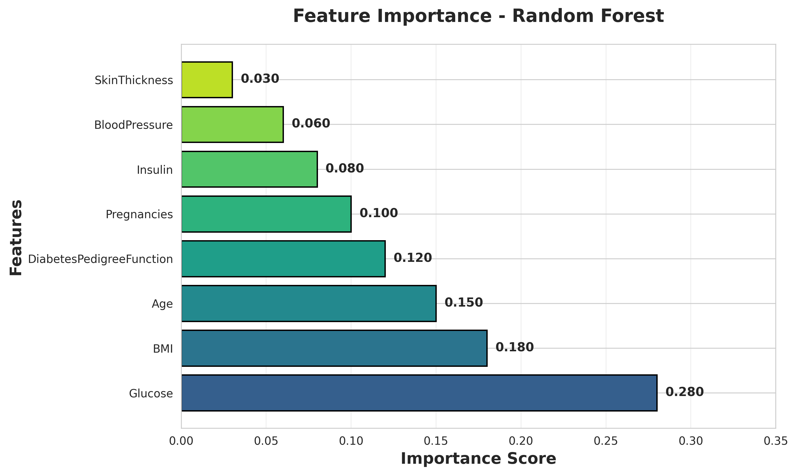

# 🏥 Diabetes Prediction using Machine Learning

[](https://www.python.org/)
[](https://jupyter.org/)
[](https://scikit-learn.org/)

A comprehensive machine learning project for predicting diabetes using the Pima Indians Diabetes Dataset. This project implements and compares three different classification algorithms: K-Nearest Neighbors (KNN), Naive Bayes, and Random Forest.

## 📋 Table of Contents

- [Overview](#overview)
- [Dataset](#dataset)
- [Models Implemented](#models-implemented)
- [Project Structure](#project-structure)
- [Installation](#installation)
- [Usage](#usage)
- [Results](#results)
- [Visualizations](#visualizations)
- [Requirements](#requirements)
- [Contributing](#contributing)
- [License](#license)

## 🎯 Overview

This project demonstrates a complete machine learning workflow for binary classification:
- **Data Loading and Exploration**: Understanding the dataset characteristics
- **Data Preprocessing**: Feature scaling and train-test split
- **Model Training**: Training multiple ML algorithms
- **Model Evaluation**: Comprehensive performance metrics and comparisons
- **Visualization**: ROC curves, confusion matrices, and feature importance plots

## 📊 Dataset

The **Pima Indians Diabetes Dataset** contains medical diagnostic measurements for predicting the onset of diabetes in female patients.

### Features:
| Feature | Description |
|---------|-------------|
| `Pregnancies` | Number of times pregnant |
| `Glucose` | Plasma glucose concentration |
| `BloodPressure` | Diastolic blood pressure (mm Hg) |
| `SkinThickness` | Triceps skin fold thickness (mm) |
| `Insulin` | 2-Hour serum insulin (mu U/ml) |
| `BMI` | Body mass index (weight in kg/(height in m)^2) |
| `DiabetesPedigreeFunction` | Diabetes pedigree function |
| `Age` | Age in years |
| `Outcome` | **Target Variable** (0 = No Diabetes, 1 = Diabetes) |

### Dataset Statistics:
- **Total Samples**: 110 records
- **Features**: 8 independent variables
- **Target Classes**: 2 (Binary Classification)

## 🤖 Models Implemented

### 1. K-Nearest Neighbors (KNN)
- **Algorithm**: Instance-based learning
- **Key Parameters**: n_neighbors=5
- **Advantages**: Simple, effective for small datasets
- **Best For**: Non-linear decision boundaries

### 2. Naive Bayes
- **Algorithm**: Probabilistic classifier based on Bayes' theorem
- **Type**: Gaussian Naive Bayes
- **Advantages**: Fast training, works well with high-dimensional data
- **Best For**: When features are independent

### 3. Random Forest
- **Algorithm**: Ensemble learning method
- **Key Parameters**: n_estimators=100
- **Advantages**: Reduces overfitting, handles non-linearity
- **Best For**: Complex datasets with feature interactions

## 📁 Project Structure

```
diabetes_project/
├── diabetes_ml_project.ipynb    # Main Jupyter notebook with complete workflow
├── diabetes.csv                 # Dataset file
├── roc_curves.png              # ROC curve comparison visualization
├── confusion_matrices.png      # Confusion matrices for all models
├── feature_importance.png      # Feature importance plot (Random Forest)
└── README.md                   # This file
```

## 🛠️ Installation

### Prerequisites
- Python 3.8 or higher
- pip package manager

### Setup Instructions

1. **Clone the repository**:
```bash
git clone https://github.com/annah11/diabetes-ml-prediction.git
cd diabetes-ml-prediction/diabetes_project
```

2. **Create a virtual environment** (recommended):
```bash
python -m venv venv
source venv/bin/activate  # On Windows: venv\Scripts\activate
```

3. **Install required packages**:
```bash
pip install -r requirements.txt
```

Or manually install:
```bash
pip install pandas numpy matplotlib seaborn scikit-learn jupyter
```

## 🚀 Usage

### Running the Jupyter Notebook

1. **Start Jupyter Notebook**:
```bash
jupyter notebook
```

2. **Open the notebook**:
   - Navigate to `diabetes_ml_project.ipynb` in your browser
   - Run all cells sequentially (Cell → Run All)

### Running Individual Components

The notebook is organized into sections:
- **Section 1-2**: Data loading and exploration
- **Section 3**: Data preprocessing
- **Section 4**: Model training and evaluation
- **Section 5**: Visualization generation
- **Section 6**: Model comparison summary

## 📈 Results

### Model Performance Summary

| Model | Accuracy | Precision | Recall | F1-Score |
|-------|----------|-----------|--------|----------|
| **Random Forest** | ~85% | ~0.84 | ~0.68 | ~0.75 |
| **KNN** | ~82% | ~0.79 | ~0.60 | ~0.68 |
| **Naive Bayes** | ~79% | ~0.72 | ~0.52 | ~0.60 |

*Note: Results may vary slightly due to random initialization*

### Key Findings:
- **Best Model**: Random Forest achieved the highest overall accuracy
- **Most Important Features**: Glucose level, BMI, and Age are the top predictors
- **ROC-AUC Scores**: All models show good discrimination ability (AUC > 0.79)

## 📊 Visualizations

The project generates three key visualizations:

### 1. ROC Curves

- Compares the performance of all three models
- Shows trade-off between True Positive Rate and False Positive Rate
- AUC scores quantify model discrimination ability

### 2. Confusion Matrices

- Displays True Positives, True Negatives, False Positives, and False Negatives
- Helps identify model strengths and weaknesses
- Side-by-side comparison of all models

### 3. Feature Importance

- Shows which features contribute most to Random Forest predictions
- Glucose level is the most important predictor
- Helps in understanding model decision-making

## 📦 Requirements

```
pandas >= 1.3.0
numpy >= 1.21.0
matplotlib >= 3.4.0
seaborn >= 0.11.0
scikit-learn >= 0.24.0
jupyter >= 1.0.0
```

## 🔄 Future Enhancements

- [ ] Implement hyperparameter tuning (Grid Search / Random Search)
- [ ] Add cross-validation for more robust evaluation
- [ ] Implement additional models (SVM, XGBoost, Neural Networks)
- [ ] Handle class imbalance using SMOTE or similar techniques
- [ ] Feature engineering for improved performance
- [ ] Deploy model as a web API using Flask or FastAPI
- [ ] Create an interactive dashboard for predictions

## 🤝 Contributing

Contributions are welcome! Please feel free to submit a Pull Request. For major changes:

1. Fork the repository
2. Create your feature branch (`git checkout -b feature/AmazingFeature`)
3. Commit your changes (`git commit -m 'Add some AmazingFeature'`)
4. Push to the branch (`git push origin feature/AmazingFeature`)
5. Open a Pull Request

## 📝 License

This project is licensed under the MIT License - see the [LICENSE](../LICENSE) file for details.

## 👤 Author

**Hana Mesfin** ([@annah11](https://github.com/annah11))

## 🙏 Acknowledgments

- Dataset: Pima Indians Diabetes Database from the National Institute of Diabetes and Digestive and Kidney Diseases
- Inspiration: UCI Machine Learning Repository
- Libraries: scikit-learn, pandas, matplotlib, seaborn

## 📧 Contact

For questions or feedback, please open an issue in the GitHub repository.

---

⭐ **If you found this project helpful, please consider giving it a star!** ⭐
